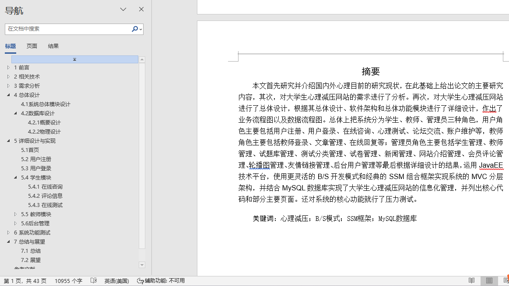

## 基于SSM框架的校园心理咨询服务平台(程序+报告)

- <b>完整代码获取地址：从戎源码网 ([https://armycodes.com/](https://armycodes.com/))</b>
- <b>技术探讨、资料分享，请加QQ群：692619798</b> 
- <b>作者微信：19941326836  QQ：952045282</b> 
- <b>承接计算机毕业设计、Java毕业设计、Python毕业设计、深度学习、机器学习</b>
- <b>选题+开题报告+任务书+程序定制+安装调试+论文+答辩ppt 一条龙服务</b>
- <b>所有选题地址 ([https://github.com/YuLin-Coder/AllProjectCatalog](https://github.com/YuLin-Coder/AllProjectCatalog)) </b>

## 项目介绍
基于SSM框架的校园心理咨询服务平台，项目分为用户和管理员两个角色，主要功能如下

前台-首页
前台-注册
前台-专家指导
前台-在线交流
前台-心理导师
前台-心理文章
前台-心理测试
后台登录
后台-评论管理
后台-交流版块管理
后台-帖子管理
后台-文章管理
后台-测试分类管理
后台-测试试卷管理
后台-测试题库管理
后台-用户管理
后台-网站导航管理

## 项目技术
- 编程语言：Java
- 数据库：MySQL
- 前端技术：JSP、JavaScript、jquery
- 后端技术：Spring、SpringMVC、MyBatis

## 运行环境
- JDK版本：JDK1.8及以上
- 开发工具：IDEA、Ecplise、Myecplise都可以
- 数据库: MySQL5.7及以上

## 运行截图

